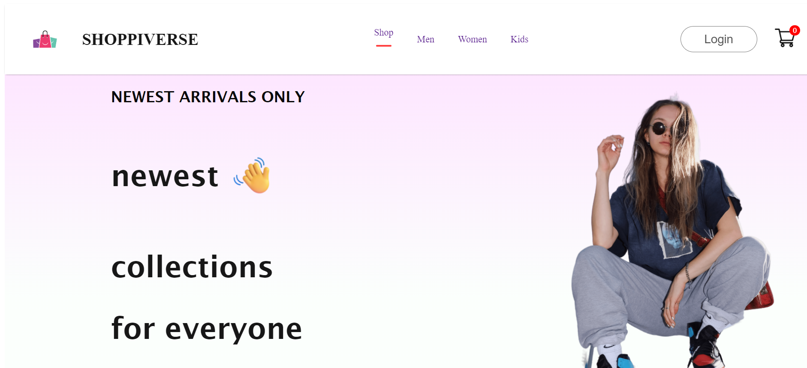

This MERN stack e-commerce web application offers a comprehensive platform for users to browse, purchase, and pay for products seamlessly. Users can create accounts, log in, and manage their profiles. The application supports secure payment processing to ensure safe transactions. Admins have robust tools to add, edit, and remove products from the inventory, maintaining a dynamic and up-to-date product catalog. The project leverages MongoDB for the database, Express for the server framework, React for the frontend, and Node.js for the backend, creating a powerful, full-stack solution for modern e-commerce needs. The user-friendly interface and secure operations enhance the overall shopping experience.
